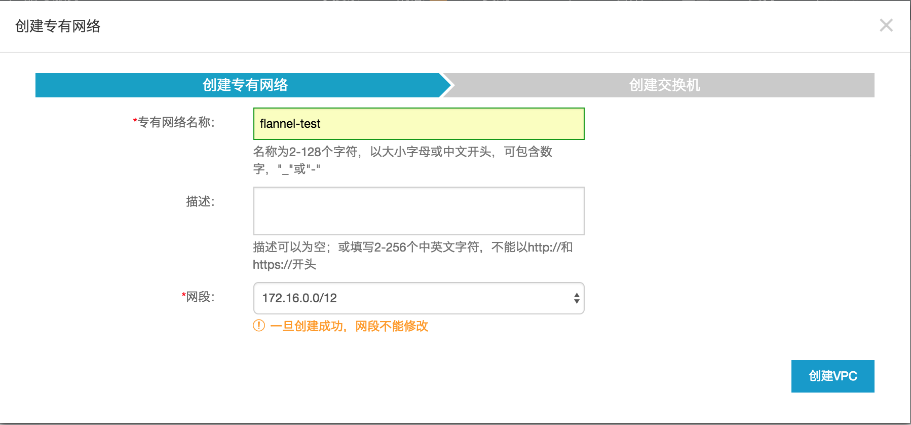
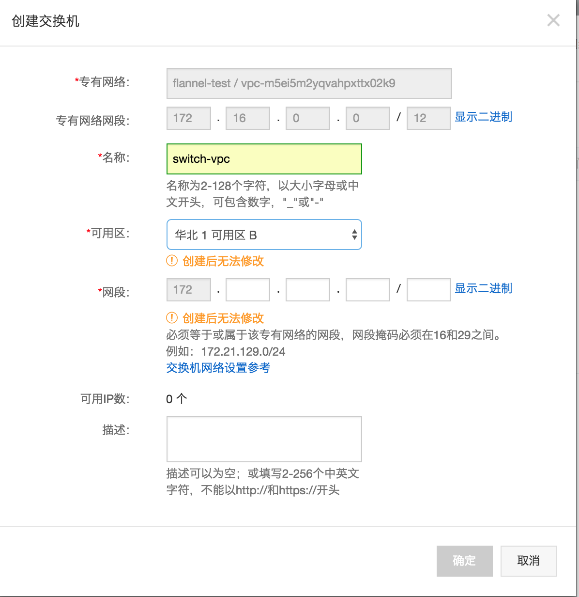
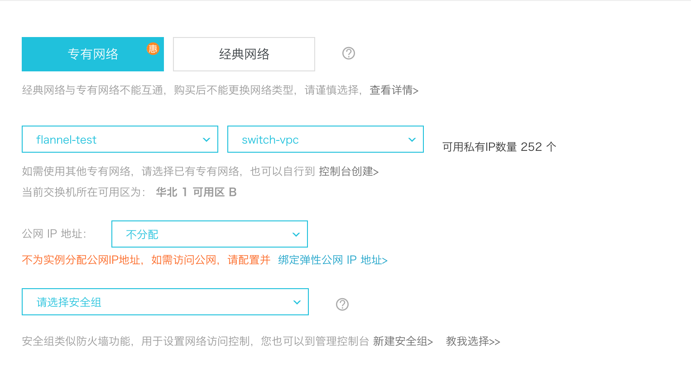
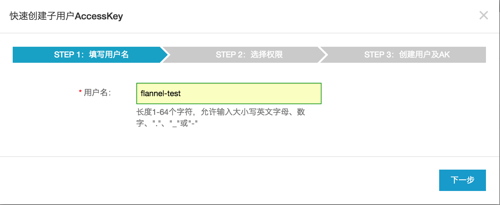
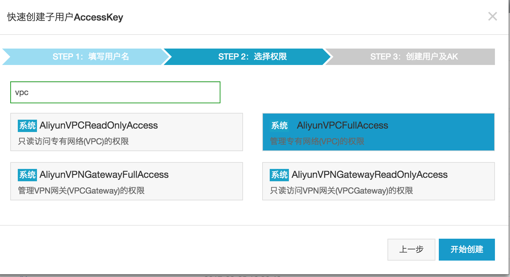
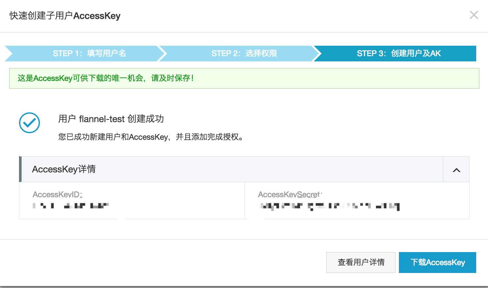

# Flannel 阿里云专有网络模式

如果需要运行在阿里云的专有网络上，我们推荐使用阿里云专有网络模式（ali-vpc backend）来替代封装IP规则以取得最佳的表现。因为使用这种模式，不需要额外的 flannel 接口。

在阿里云上使用 flannel 之前首先需要创建一个[专有网络](https://vpc.console.aliyun.com/#/vpc/cn-hangzhou/list)

### 创建专有网络 (VPC)

进入阿里云 [专有网络](https://vpc.console.aliyun.com/#/vpc/cn-qingdao/list) 控制台，点击 `创建专有网络` 来创建。



- 为专有网络设定一个名称
- 选择专有网络的私有网段 192.168.0.0/16, 172.16.0.0/12, or 10.0.0.0/8 .根据集群的大小来选择。
- 点击 `创建VPC` ，然后等待创建完成

### 创建交换机 (switch)

在VPC管理页面点击交换机进入交换机列表。然后点击创建交换机



- 设置交换机的名称。
- 设置交换机所在可用区，与 ECS 所在可用区相同。
- 设置交换机所在网段，需要在专有网络的网段之内。
- 点击确认后创建

### 创建实例 (Instance)


创建一个专有网络内的实例，然后把实例加入到先前创建的 VPC 中，并且选择使用的交换机。实例必须与先前创建的交换机在同一个可用区。



### 创建子用户

[点击链接](https://ram.console.aliyun.com/#/user/list?guide) 创建子用户。

+ 选择用户名称
+ 选择子用户的权限
+ 记录下用户的AccessKey 与AccessKeySecrets







### 启动实例

剩下的步骤就是 开启 etcd 然后把网络配置写入到 etcd 中，然后运行 flannel 。

首先 `SSH`  到实例上

- 开启 ETCD:

```
$ etcd --advertise-client-urls http://$INTERNAL_IP:2379 --listen-client-urls http://0.0.0.0:2379
```
- 把配置写入到 ETCD 中（注意网络范围不要与VPC的网络有重叠）。

```
$ etcdctl set /coreos.com/network/config '{"Network":"10.24.0.0/16", "Backend": {"Type": "ali-vpc"}}'
```
- 从 https://github.com/coreos/flannel/ 上拉取最新的分支
- 编译项目
- 设置环境变量

```
export ACCESS_KEY_ID=YOUR_ACCESS_KEY_SECRET
export ACCESS_KEY_SECRET=YOUR_ACCESS_KEY_SECRET
```

- 运行 flannel :

```
sudo ./flanneld --etcd-endpoints=http://127.0.0.1:2379
```

然后创建一个同样的实例并且连接。
运行 flannel 时候制定 `--etcd-endpoints` 来制定使用的ETCD。

确认创建的每一个子网都在路由表上有相应的记录。


### 限制


阿里云每个路由表[限制](https://vpc.console.aliyun.com/#/vpc/cn-hangzhou/detail/vpc-bp11xpfe5ev6wvhfb14b6/router)最多只能创建48个自定义路由条目。如果你需要更多的路由规则，可以发工单请求更多的配合或者切换到 VXLAN 后台模式。